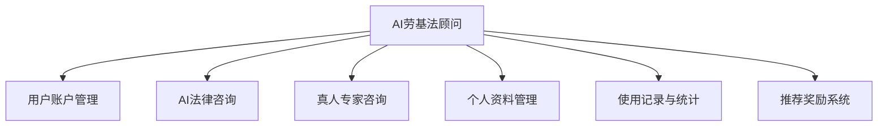
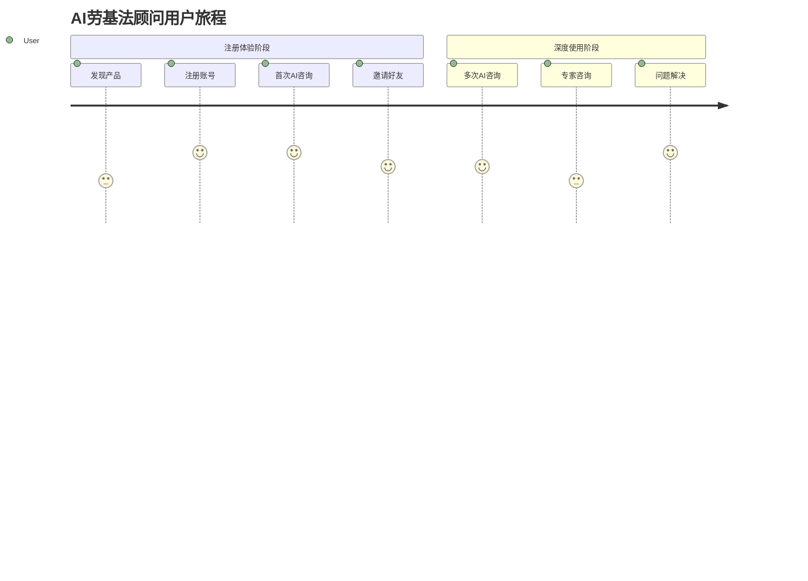
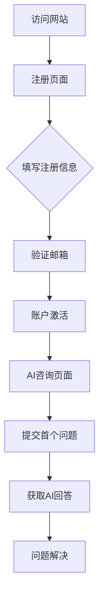
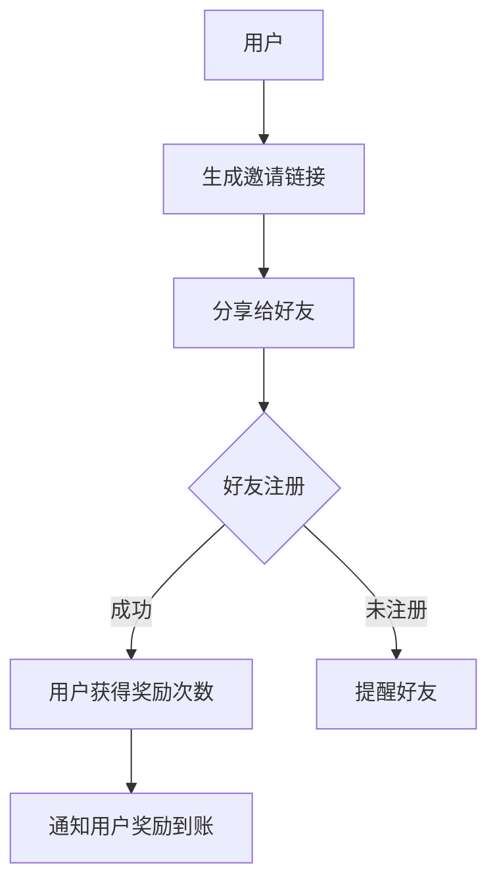

# AI劳基法顾问产品需求文档(PRD)

## 1. 文档信息
### 1.1 版本历史
| 版本 | 日期 | 作者 | 变更描述 |
|------|------|------|----------|
| 0.1  | 2025/5/10 | Cline | 初始版本 |
| 0.2  | 2025/5/10 | Cline | 添加数据库设计、管理后台和前端需求规划 |

### 1.2 文档目的
本文档定义AI劳基法顾问应用的核心需求，为设计、开发和测试团队提供明确指导。

### 1.3 相关文档引用
- 产品路线图(Roadmap.md)
- 用户故事地图(User_Story_Map.md)
- 指标框架(Metrics_Framework.md)

## 2. 产品概述
### 2.1 产品名称与定位
产品名称：AI劳基法顾问
定位：面向台湾用户的劳动法规AI咨询平台

### 2.2 产品愿景与使命
愿景：成为台湾最专业易用的劳动法规咨询平台
使命：通过AI技术降低劳动法规咨询门槛

### 2.3 价值主张与独特卖点(USP)
- 结合AI快速响应与真人专家深度解答
- 创新的邀请机制降低获客成本
- 行业专业化咨询服务

### 2.4 目标平台列表
- Web (主平台)
- 响应式移动端Web
- LINE (通过二维码接入)

### 2.5 产品核心假设
1. 台湾用户愿意尝试AI法律咨询
2. 邀请机制能有效促进用户增长
3. 10次免费咨询能满足初期用户体验

### 2.6 商业模式概述
- 免费基础AI咨询+增值专家服务
- 潜在变现方式：专家咨询收费、企业定制服务

## 3. 用户研究
### 3.1 目标用户画像
#### 3.1.1 人口统计特征
- 地区：台湾
- 年龄：20-50岁职场人群
- 职业：各行业在职人员

#### 3.1.2 行为习惯与偏好
- 习惯使用LINE沟通
- 偏好简单直接的咨询服务
- 对隐私保护要求较高

#### 3.1.3 核心需求与痛点
- 快速获取劳动法规解答
- 不确定劳动权益时的专业指导
- 便捷的咨询渠道

#### 3.1.4 动机与目标
- 解决工作中的劳动纠纷
- 了解自身劳动权益
- 获取专业法律意见

### 3.2 用户场景分析
#### 3.2.1 核心使用场景
1. 新用户注册并尝试AI咨询
2. 邀请好友获得额外咨询次数
3. 升级到真人专家咨询

#### 3.2.2 边缘使用场景
- 企业HR批量咨询需求
- 长时间的复杂案例咨询

### 3.3 用户调研洞察
本产品基于对台湾劳动法律咨询市场的理解和行业最佳实践假设。
实际发布后将通过用户反馈、使用数据和满意度调查进行迭代调整。

## 4. 市场与竞品分析
### 4.1 市场规模与增长预测
- 台湾法律服务市场约350亿新台币，劳动法领域占10-15%
- 数字法律服务年增长率20-30%
- 在线法律咨询未来5年复合增长率约25%

### 4.2 行业趋势分析
- AI应用在法律咨询领域迅速发展
- 服务去中介化，直接面向终端用户
- 专业垂直领域细分化发展
- 用户体验消费化

### 4.3 竞争格局分析
#### 4.3.1 直接竞争对手详析
- 传统法律咨询APP：专业但价格高、响应慢
- HR系统法务模块：缺乏专业深度
- 通用AI助手：缺乏专业性和本地化

#### 4.3.2 间接竞争对手概述
- 传统律师事务所
- 政府劳工局咨询服务
- 工会组织法律援助

### 4.4 竞品功能对比矩阵
| 功能 | AI劳基法顾问 | 传统法律APP | HR系统模块 |
|------|-------------|------------|-----------|
| AI问答 | ✅专业深度 | ❌无 | ⚠️基础 |
| 响应速度 | ✅即时 | ⚠️慢 | ⚠️一般 |
| 价格 | ✅低(免费+付费) | ❌高 | ⚠️中 |

### 4.5 市场差异化策略
- 垂直领域专精策略
- 双模式服务(AI+人工)策略
- 社交推广激励策略
- 用户体验简化策略

## 5. 产品功能需求
### 5.1 功能架构与模块划分


### 5.2 核心功能详述
#### 5.2.1 用户账户管理模块
**功能描述：**  
作为新用户，我想要通过邮箱注册并登录系统，以便获取劳基法AI咨询服务。

**用户价值：**  
建立个人账户，安全便捷地使用服务，保存咨询历史，追踪使用次数。

**功能逻辑与规则：**
- **注册流程：**
  1. 用户输入电子邮箱、密码和基础信息
  2. 系统发送验证邮件至注册邮箱
  3. 用户通过验证链接确认邮箱
  4. 注册完成，自动激活10次免费咨询额度

- **登录流程：**
  1. 用户输入已注册邮箱和密码
  2. 系统验证凭据并生成认证令牌
  3. 重定向用户至主页

**数据库设计需求规划：**
- **用户表(users)**：
  - id: 唯一标识符(主键)
  - email: 用户邮箱(唯一索引)
  - password_hash: 加密密码
  - created_at: 创建时间
  - updated_at: 更新时间
  - last_login_at: 最后登录时间
  - status: 账户状态(active/pending/disabled)
  - remaining_free_queries: 剩余免费咨询次数
  - total_queries: 累计咨询次数
  - verification_token: 邮箱验证令牌
  - reset_token: 密码重置令牌
  - reset_token_expiry: 令牌过期时间

- **用户资料表(user_profiles)**：
  - id: 唯一标识符(主键)
  - user_id: 关联用户ID(外键)
  - industry: 行业
  - position: 职位
  - company: 公司名称(选填)
  - created_at: 创建时间
  - updated_at: 更新时间

**管理后台设计需求规划：**
- **用户管理界面**：
  - 用户列表视图(分页、排序、筛选)
  - 用户详情页(基本信息、使用统计)
  - 账户操作功能(启用/禁用、重置免费次数)
  - 批量操作功能(导出、批量状态更改)
  - 审计日志(账户操作记录)

- **统计与报表**：
  - 注册用户数量趋势图
  - 活跃用户统计
  - 转化率分析(注册-使用-推荐)

**前端设计需求规划：**
- **注册页面**：
  - 简洁的表单设计，分步骤引导注册
  - 实时表单验证，清晰的错误提示
  - 显著的隐私政策和服务条款链接

- **登录页面**：
  - 简洁的登录表单
  - "记住我"选项
  - 找回密码链接
  - 引导新用户注册的入口
  
- **账户设置页面**：
  - 分类标签式设计，包含个人信息、安全设置、通知偏好
  - 直观的表单编辑界面
  - 更改密码功能
  - 账户安全状态指示

**交互要求：**
- 表单验证应在客户端实时进行
- 注册流程应简洁，避免过多必填项
- 登录状态应在会话期内保持

**数据需求：**
- 用户基本信息：邮箱、加密密码、注册时间
- 账户状态：活跃、待验证、禁用
- 使用统计：剩余免费次数、累计使用次数

**技术依赖：**
- JWT或类似机制进行身份验证
- 安全的密码加密存储
- 邮件发送服务

**验收标准：**
- 80%的注册用户能在2分钟内完成全流程
- 验证邮件发送成功率≥99%
- 密码重置流程平均完成时间<3分钟

#### 5.2.2 AI法律咨询模块
**功能描述：**  
作为注册用户，我想要在AI咨询页面向AI顾问提问关于台湾劳基法的问题，以便获得准确、及时的法律咨询和建议。

**用户价值：**  
无需预约，随时随地获取专业的劳基法咨询，节省时间和费用，同时保障隐私。

**功能逻辑与规则：**
- **咨询流程：**
  1. 用户进入AI咨询页面
  2. 系统显示剩余免费咨询次数
  3. 用户输入劳基法相关问题
  4. 系统通过N8N集成将问题发送至AI处理
  5. AI根据问题内容生成专业回答
  6. 每轮问答计为一次使用

- **次数管理规则：**
  1. 新用户注册获得10次免费咨询机会
  2. 每成功邀请一位新用户注册，获得10次额外免费咨询
  3. 系统自动记录并更新剩余次数

**数据库设计需求规划：**
- **咨询会话表(chat_sessions)**：
  - id: 唯一标识符(主键)
  - user_id: 关联用户ID(外键)
  - created_at: 创建时间
  - updated_at: 最后更新时间
  - status: 会话状态(active/closed)
  - title: 自动生成的会话标题
  - tags: 问题标签(数组或关联表)

- **咨询消息表(chat_messages)**：
  - id: 唯一标识符(主键)
  - session_id: 会话ID(外键)
  - role: 消息发送者角色(user/ai)
  - content: 消息内容
  - created_at: 创建时间
  - references: 引用法条或案例(JSON格式)
  - feedback: 用户反馈(有用/无用/null)

- **使用记录表(usage_logs)**：
  - id: 唯一标识符(主键)
  - user_id: 用户ID(外键)
  - session_id: 会话ID(外键)
  - usage_type: 使用类型(free/reward/paid)
  - created_at: 创建时间
  - ip_address: 用户IP地址(安全审计用)

**管理后台设计需求规划：**
- **AI咨询监控界面**：
  - 实时咨询会话监控
  - 热门问题分析
  - 问题类型分布统计
  - 用户满意度跟踪
  - 异常回答标记与修正

- **知识库管理**：
  - 法规库更新管理
  - 常见问题维护
  - 回答模板编辑
  - 专业术语解释库

- **使用统计**：
  - 每日/周/月咨询量统计
  - 平均会话时长分析
  - 高峰使用时段图表
  - 用户使用频率分布

**前端设计需求规划：**
- **AI咨询界面**：
  - 聊天式交互界面，清晰区分用户和AI回复
  - 顶部显示剩余免费次数
  - 输入区带有提示性示例
  - 支持富文本格式化的回答展示
  - 法条引用以特殊样式突出显示
  - 消息状态指示(发送中、已读、思考中)

- **交互细节**：
  - 打字动画效果增强真实感
  - 会话懒加载提升性能
  - 一键复制回答内容
  - 收藏重要回答功能
  - 历史会话导航侧边栏
  - 智能问题建议

- **会话管理界面**：
  - 会话列表卡片式设计
  - 标题和预览内容展示
  - 时间排序和搜索功能
  - 删除和归档操作
  - 会话分类标签

**交互要求：**
- 对话界面简洁清晰，类聊天软件样式
- 支持富文本回答，包含链接、加粗、列表等格式
- 显示思考状态（如"正在分析中..."）减少等待焦虑

**数据需求：**
- 用户会话历史记录
- 使用次数统计
- AI响应内容及引用法条
- 用户评价反馈

**技术依赖：**
- N8N工作流集成
- Claude模型API或其他AI服务
- 台湾劳基法知识库
- 实时通信技术（WebSocket等）

**验收标准：**
- AI回答准确率≥90%（由法律专家评估）
- 平均响应时间<5秒
- 用户满意度评分≥4.5（满分5分）

#### 5.2.3 真人专家咨询模块
**功能描述：**  
作为用户，当AI无法满足我的复杂咨询需求时，我希望能够联系真人劳动法专家进行深入咨询，以获得更专业、全面的解决方案。

**用户价值：**  
解决AI无法处理的复杂或特殊劳动法问题，提供更高层次的专业服务，建立用户对平台的信任感。

**功能逻辑与规则：**
- **咨询申请流程：**
  1. 用户在AI咨询页面点击"联系真人专家"按钮
  2. 系统引导用户填写咨询表单
  3. 用户提交问题描述、相关背景信息和联系方式
  4. 系统生成咨询工单，分配给相应专业领域专家

- **LINE直接联系：**
  1. 用户扫描专家联系页面上的LINE二维码
  2. 添加官方LINE账号为好友
  3. 通过LINE发送咨询请求
  4. 客服人员初步筛选问题并转接专家

**数据库设计需求规划：**
- **专家咨询表(expert_consultations)**：
  - id: 唯一标识符(主键)
  - user_id: 用户ID(外键)
  - status: 状态(pending/assigned/in_progress/completed/cancelled)
  - title: 咨询标题
  - description: 问题描述
  - created_at: 创建时间
  - updated_at: 更新时间
  - priority: 优先级(normal/urgent)
  - contact_method: 联系方式(form/line)
  - attachment_urls: 附件链接(JSON数组)

- **专家表(experts)**：
  - id: 唯一标识符(主键)
  - name: 专家姓名
  - title: 职称
  - specialties: 专长领域(数组)
  - bio: 简介
  - status: 状态(active/inactive)
  - created_at: 创建时间
  - updated_at: 更新时间

- **专家分配表(expert_assignments)**：
  - id: 唯一标识符(主键)
  - consultation_id: 咨询ID(外键)
  - expert_id: 专家ID(外键)
  - assigned_at: 分配时间
  - status: 状态(assigned/accepted/completed)
  - response_time: 首次响应时间
  - completion_time: 完成时间
  - notes: 内部备注

**管理后台设计需求规划：**
- **咨询工单管理**：
  - 工单队列视图(待分配/处理中/已完成)
  - 优先级排序和标记系统
  - 专家分配界面
  - 工单详情与历史记录
  - 状态流转控制

- **专家管理**：
  - 专家资料维护
  - 专长分类与标签
  - 工作量统计
  - 响应时间与满意度评价
  - 排班管理

- **LINE消息管理**：
  - LINE消息列表
  - 快速回复模板
  - 消息状态跟踪
  - 将LINE会话转为正式工单

**前端设计需求规划：**
- **专家咨询申请表单**：
  - 清晰的表单设计，必填项最小化
  - 分步骤引导用户提供关键信息
  - 支持拖拽上传附件
  - 优先级选择选项
  - 服务条款和预期说明
  
- **LINE连接界面**：
  - 醒目的二维码展示
  - 添加LINE好友的步骤指南
  - 使用LINE咨询的最佳实践说明
  - 示例问题类型展示

- **咨询状态跟踪页**：
  - 可视化的工单处理进度条
  - 状态变更时间轴
  - 专家回复展示区
  - 补充信息提交功能
  - 满意度评价入口

**交互要求：**
- 表单设计清晰，字段最小化，减少填写负担
- 提供问题描述模板，引导用户提供关键信息
- LINE二维码放置显著位置，配有明确引导文案

**数据需求：**
- 咨询表单内容及附件
- 专家分类及专长数据
- 用户联系信息
- 工单状态跟踪

**技术依赖：**
- 工单管理系统
- LINE官方账号API集成
- 专家排班与分配系统
- 安全的文件上传与存储

**验收标准：**
- 95%的咨询申请能在承诺时间内获得响应
- 真人专家服务满意度≥4.7（满分5分）
- LINE好友添加到首次回复平均时间<30分钟

### 5.3 次要功能描述
(略)

### 5.4 未来功能储备
(略)

## 6. 用户流程与交互设计指导
### 6.1 核心用户旅程地图


### 6.2 关键流程详述与状态转换图
**用户注册与首次咨询流程**


**邀请好友获取免费咨询次数流程**


**专家咨询流程**
```mermaid
graph TD
    A[AI咨询页面] --> B[点击"专家咨询"]
    B --> C[填写咨询表单]
    C --> D[提交申请]
    D --> E[系统分配专家]
    E --> F[专家响应]
    F --> G[问题解决]
    A --> H[扫描LINE二维码]
    H --> I[添加官方LINE]
    I --> J[发送咨询信息]
    J --> K[客服转接专家]
    K --> F
```

### 6.3 对设计师的界面原型参考说明和要求
- 整体风格：专业可信赖，现代简约
- 色彩方案：以蓝色为主色调，象征专业与信任
- 交互样式：直观易用，减少学习成本
- 响应式设计：确保在各种设备上的良好体验
- 无障碍设计：符合WCAG 2.1 AA级标准

**核心界面要求**
- **AI咨询界面**：类聊天软件的直观交互，突出法律条文引用
- **专家咨询申请**：低阻力表单设计，减少放弃率
- **用户中心**：清晰显示使用统计和账户信息

**特殊交互要点**
- AI思考状态动画：减轻等待焦虑
- 法条引用卡片式设计：方便阅读理解
- 咨询历史时间轴视图：易于回顾

### 6.4 交互设计规范与原则建议
- **简明原则**：减少专业术语使用，以通俗易懂的语言表述
- **引导式设计**：关键功能配有简短指引
- **反馈机制**：所有操作都有明确的成功/失败反馈
- **预防错误**：在可能出错的地方提供预防性提示
- **一致性原则**：交互模式在整个产品中保持一致
- **渐进式引导**：新用户首次使用时提供功能简介
- **减少认知负荷**：每个页面聚焦于单一主要功能

**数据库设计需求规划**
- **界面配置表(ui_configs)**：
  - id: 唯一标识符(主键)
  - component_key: 组件标识
  - config_data: 界面配置数据(JSON格式)
  - active: 是否启用
  - created_at: 创建时间
  - updated_at: 更新时间

- **用户界面偏好表(user_ui_preferences)**：
  - id: 唯一标识符(主键)
  - user_id: 用户ID(外键)
  - theme: 主题偏好(light/dark)
  - font_size: 字体大小偏好
  - language: 语言偏好
  - notifications: 通知设置(JSON格式)
  - updated_at: 更新时间

**管理后台设计需求规划**
- **界面配置管理**：
  - 主题色彩配置
  - 组件显示控制
  - 文案库管理
  - A/B测试设置界面

- **用户体验监控**：
  - 用户行为热图
  - 界面使用时长分析
  - 放弃率与转化率监控
  - 用户反馈聚合展示

**前端设计需求规划**
- **布局系统**：
  - 响应式布局架构
  - 移动优先设计
  - 组件化结构
  - 主题切换功能

- **交互组件库**：
  - 自定义聊天气泡组件
  - 法条引用卡片组件
  - 进度指示器组件
  - 通知提示组件
  - 引导提示组件

- **动效系统**：
  - 页面过渡动画
  - 加载状态动画
  - 操作反馈动画
  - 引导动画

## 7. 非功能需求
(略)

## 8. 技术架构考量

### 部署架构
```
Client <--> CDN <--> Frontend (ailaborlawuser:3002) <--> Backend API <--> Database
                                        ^
                                        |
                                        v
                                N8N <--> AI服務(Claude)
                                  |
                                  v
                            LINE Official Account
```

### 开发环境
- **前端服务器**:
  - 名称: ailaborlawuser
  - 端口: 3003
  - 内网调试地址: http://ailaborlawuser.ns-2rlrcc3k.svc.cluster.local:3003
  - 公网调试地址: https://wmdelchfajsi.sealosgzg.site

- **后端服务器**:
  - 名称: ailabordevbox
  - 端口: 3001
  - 内网调试地址: http://ailabordevbox.ns-2rlrcc3k.svc.cluster.local:3001
  - 公网调试地址: https://wrrfvodsaofk.sealosgzg.site

## 9. 验收标准汇总
(略)

## 10. 产品成功指标
(略)
