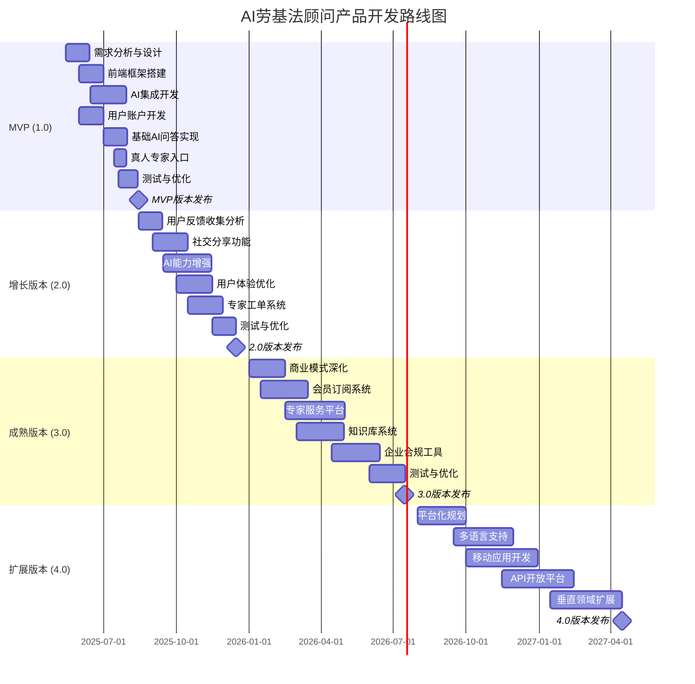

# 产品路线图 (Product Roadmap)：AI劳基法顾问

**文档版本：** 1.0.0  
**创建日期：** 2025-05-10  
**最后更新：** 2025-05-10

## 目录

1. [路线图概述](#1-路线图概述)
2. [版本规划策略](#2-版本规划策略)
3. [详细版本规划](#3-详细版本规划)
   - 3.1 [MVP版本(1.0)](#31-mvp版本10)
   - 3.2 [增长版本(2.0)](#32-增长版本20)
   - 3.3 [成熟版本(3.0)](#33-成熟版本30)
   - 3.4 [扩展版本(4.0)](#34-扩展版本40)
4. [功能优先级矩阵](#4-功能优先级矩阵)
5. [详细时间线计划](#5-详细时间线计划)
6. [资源规划](#6-资源规划)
7. [风险管理](#7-风险管理)

## 1. 路线图概述

本路线图定义了AI劳基法顾问产品的发展方向、优先级和时间安排，为产品团队提供明确的发展指导。该路线图概述了从最小可行产品(MVP)到成熟的市场化产品的演进过程，确保产品逐步实现业务目标并满足用户需求。

路线图设计基于以下原则：
- 快速推出核心功能以验证市场假设
- 优先实现用户最迫切的需求
- 循序渐进地扩展功能广度和深度
- 在实际用户反馈基础上灵活调整
- 优化留存率与转化率的平衡发展

## 2. 版本规划策略

AI劳基法顾问采用增量式迭代开发策略，将依次经历以下四个主要发展阶段：

1. **验证阶段(MVP 1.0)**: 验证核心价值假设，含基本功能集
   - 周期：3个月
   - 关注点：核心功能可用性、技术可行性验证、初始用户反馈收集

2. **增长阶段(2.0)**: 优化用户体验，提高用户增长和留存
   - 周期：6个月
   - 关注点：改善用户体验、扩展核心功能、增强产品稳定性

3. **成熟阶段(3.0)**: 扩展功能广度和深度，建立商业化渠道
   - 周期：9个月
   - 关注点：付费用户转化、高级功能、稳定性和可扩展性

4. **扩展阶段(4.0+)**: 建立平台生态，拓展业务边界
   - 周期：持续
   - 关注点：新市场机会、平台化、业务模式创新

每一阶段发布后将进行全方位指标评估，包括用户增长、转化率、用户满意度和技术稳定性，评估结果将作为下一阶段规划的重要依据。

## 3. 详细版本规划

### 3.1 MVP版本(1.0)

**目标**: 构建并验证核心产品价值，获取初始用户并收集关键反馈

**关键功能**:
- **用户账户管理**:
  - 邮箱注册和登录
  - 基本个人资料管理
  - 免费次数显示与计数

- **AI法律咨询**:
  - 基础问答功能
  - N8N集成实现
  - 次数限制与记录
  - 内容保存功能

- **真人专家入口**:
  - 简单工单表单
  - LINE联系方式

- **基础界面**:
  - 响应式Web设计
  - 最小化用户引导流程

- **后台管理基础功能**:
  - 用户管理界面
  - AI咨询监控面板
  - 专家工单分配系统
  - 系统配置管理

**MVP退出标准**:
- 注册用户≥500
- 用户留存率(7天)≥30%
- 平均每用户咨询次数≥3次
- 系统稳定运行≥2周无重大问题

### 3.2 增长版本(2.0)

**目标**: 优化用户体验，提高用户留存，扩大用户基础

**关键功能**:
- **用户账户增强**:
  - 第三方登录(Google、Facebook)
  - 用户角色划分(HR/雇主/员工)
  - 个人资料完善

- **AI咨询增强**:
  - 常见问题推荐
  - 增强回答质量与深度
  - 对话上下文理解优化
  - 支持多轮对话

- **真人专家系统**:
  - 完整工单管理
  - 专家资质展示
  - 付费咨询计费系统

- **社交分享功能**:
  - 邀请奖励机制
  - 分享统计与追踪
  - 推荐码系统

- **用户体验优化**:
  - 聊天界面美化
  - 移动端适配优化
  - 用户引导流程优化

**2.0退出标准**:
- 用户总量≥3,000
- 用户留存率(30天)≥40%
- 社交分享转化率≥15%
- 真人专家咨询申请率≥5%

### 3.3 成熟版本(3.0)

**目标**: 建立完整商业模式，提升付费转化，巩固市场地位

**关键功能**:
- **高级会员系统**:
  - 不同会员等级与权益
  - 订阅付费模式
  - 企业账户与批量用户管理

- **AI能力提升**:
  - 个性化回答与推荐
  - 场景化解决方案
  - 劳资争议模拟分析
  - 文档智能生成

- **专家服务平台**:
  - 专家分类与精准匹配
  - 在线视频咨询
  - 专家评分系统
  - 服务质量标准与监控

- **内容知识库**:
  - 劳基法案例库
  - 行业特定指南
  - 法规更新提醒
  - 常见问题百科

- **企业合规工具**:
  - 人力资源政策审核
  - 合规自查清单
  - 合同模板库

**3.0退出标准**:
- 用户总量≥20,000
- 付费转化率≥3%
- 企业账户数≥50
- ARPU(每用户平均收入)≥新台币500元

### 3.4 扩展版本(4.0)

**目标**: 建立平台生态，拓展业务边界，实现持续增长

**关键功能**:
- **平台开放能力**:
  - API接口开放
  - 第三方服务集成
  - 合作伙伴平台

- **多语言支持**:
  - 英文版
  - 简体中文版
  - 多语言切换

- **扩展垂直领域**:
  - 商业法律咨询
  - 知识产权保护
  - 合同审核

- **全平台部署**:
  - 原生移动应用(iOS/Android)
  - 企业内部部署方案
  - HR系统集成插件

- **高级数据分析**:
  - 用户行为洞察
  - 劳动法趋势分析
  - 预测性合规风险提示

**4.0预期目标**:
- 用户总量≥100,000
- 付费转化率≥5%
- 企业客户≥300
- 年收入增长率≥30%

## 4. 功能优先级矩阵

基于商业价值、用户价值和实现难度评估，功能优先级划分如下:

### P0 (必须优先实现)
| 功能 | 商业价值 | 用户价值 | 实现难度 | 版本 |
|------|---------|---------|----------|------|
| 邮箱注册登录 | 高 | 高 | 低 | 1.0 |
| 基础AI问答 | 高 | 高 | 中 | 1.0 |
| N8N集成 | 高 | 高 | 中 | 1.0 |
| 使用次数跟踪 | 高 | 中 | 低 | 1.0 |
| 真人专家入口 | 高 | 高 | 低 | 1.0 |

### P1 (重要但可在MVP后实现)
| 功能 | 商业价值 | 用户价值 | 实现难度 | 版本 |
|------|---------|---------|----------|------|
| 社交分享奖励 | 高 | 中 | 中 | 2.0 |
| 多轮对话支持 | 中 | 高 | 高 | 2.0 |
| 专家工单系统 | 高 | 中 | 中 | 2.0 |
| 用户角色划分 | 中 | 高 | 低 | 2.0 |
| 常见问题推荐 | 中 | 高 | 中 | 2.0 |

### P2 (价值中等或实现复杂)
| 功能 | 商业价值 | 用户价值 | 实现难度 | 版本 |
|------|---------|---------|----------|------|
| 会员订阅系统 | 高 | 中 | 高 | 3.0 |
| 企业账户管理 | 高 | 中 | 高 | 3.0 |
| 内容知识库 | 中 | 高 | 高 | 3.0 |
| 第三方登录 | 低 | 中 | 中 | 2.0 |
| 合规自查工具 | 中 | 高 | 高 | 3.0 |

## 5. 详细时间线计划

## 6. 资源规划

### 人力资源需求

**MVP阶段 (1.0)**
- 前端开发: 2人
- 后端开发: 2人
- UI/UX设计: 1人
- 产品经理: 1人
- AI集成专家: 1人
- 法律专家顾问: 1人(兼职)
- QA测试: 1人

**增长阶段 (2.0)**
- 前端开发: 3人
- 后端开发: 3人
- UI/UX设计: 2人
- 产品经理: 1人
- AI工程师: 2人
- 法律专家顾问: 2人(兼职)
- QA测试: 2人
- 运营专员: 1人

**成熟阶段 (3.0)**
- 前端开发: 4人
- 后端开发: 4人
- UI/UX设计: 2人
- 产品经理: 2人
- AI工程师: 3人
- 法律专家顾问: 3人(全职)
- QA测试: 3人
- 运营团队: 3人
- 客服团队: 2人

### 基础设施需求

**MVP阶段 (1.0)**
- 云服务器: Sealos DevBox
- 数据库: MongoDB
- AI服务: Claude API
- 工作流平台: N8N
- 邮件服务: SendGrid或类似
- LINE官方账号: 基础版
- 域名与SSL证书

**增长阶段 (2.0)**
- 扩展服务器容量
- 引入缓存系统
- 增加数据库副本
- 引入监控系统
- 支付网关集成
- 文件存储系统

**成熟阶段 (3.0)**
- 负载均衡系统
- 多区域部署
- 完整监控与报警
- 数据备份与恢复
- 专用AI推理服务
- 安全审计系统

## 7. 风险管理

### 技术风险

| 风险 | 影响 | 可能性 | 缓解策略 |
|------|------|--------|----------|
| AI回答准确性不足 | 高 | 中 | 1. 专业审核与数据优化 2. 明确边界条件处理 3. 真人专家备选方案 |
| N8N集成复杂性 | 中 | 高 | 1. 提前进行POC验证 2. 预留足够开发时间 3. 准备替代方案 |
| 系统性能瓶颈 | 高 | 中 | 1. 性能测试常态化 2. 可扩展架构设计 3. 负载预估与容量规划 |
| 数据安全漏洞 | 高 | 低 | 1. 安全审计 2. 数据加密 3. 访问权限控制 4. 定期安全测试 |

### 业务风险

| 风险 | 影响 | 可能性 | 缓解策略 |
|------|------|--------|----------|
| 用户增长低于预期 | 高 | 中 | 1. 调整营销策略 2. 增强产品差异化 3. 优化用户引导流程 4. 增加免费次数或活动 |
| 付费转化率低 | 高 | 中 | 1. 优化付费价值 2. 测试不同定价策略 3. 增加高价值功能 4. 针对性用户调研 |
| 竞争对手快速跟进 | 中 | 高 | 1. 加速产品迭代 2. 强化差异化优势 3. 建立专家网络壁垒 4. 提前布局相关领域 |
| 法规变动影响 | 高 | 中 | 1. 建立法规监测机制 2. 保持与专家的合作 3. 快速更新知识库 4. 提前沟通重大变更 |

### 运营风险

| 风险 | 影响 | 可能性 | 缓解策略 |
|------|------|--------|----------|
| 专家资源不足 | 高 | 中 | 1. 提前建立专家网络 2. 实施灵活的激励机制 3. 与相关机构合作 4. 专家服务标准化 |
| 用户满意度下降 | 高 | 低 | 1. 实时监控满意度指标 2. 建立快速响应机制 3. 定期用户访谈 4. 持续优化产品体验 |
| 运营成本超预期 | 中 | 中 | 1. 精细化成本控制 2. 自动化流程优化 3. 调整资源配置 4. 明确ROI评估 |
| 品牌信任危机 | 高 | 低 | 1. 质量控制体系 2. 危机公关预案 3. 透明沟通机制 4. 法律合规审查 |

### 风险应对计划

对于高影响风险，我们将：
1. 指定专人负责监控
2. 制定详细的应急预案
3. 设置明确的预警指标
4. 定期进行风险评估回顾
5. 将关键风险纳入项目例会议题

风险管理将作为产品管理的常态化工作，每月进行一次全面评估，确保及时发现并应对可能的风险。
