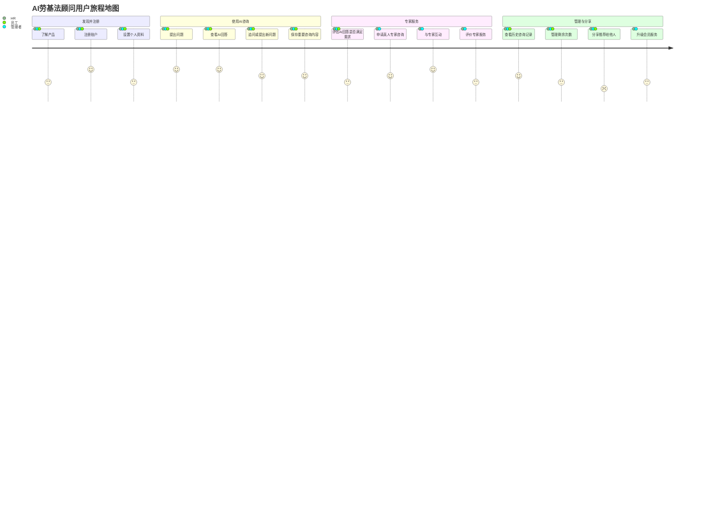

# 用户故事地图 (User Story Map)：AI劳基法顾问

**文档版本：** 1.0.0  
**创建日期：** 2025-05-10  
**最后更新：** 2025-05-10

## 目录

1. [文档说明](#1-文档说明)
2. [核心用户角色](#2-核心用户角色)
3. [用户故事地图概览](#3-用户故事地图概览)
4. [详细用户故事](#4-详细用户故事)
   - 4.1 [企业人力资源人员故事](#41-企业人力资源人员故事)
   - 4.2 [中小企业管理者/雇主故事](#42-中小企业管理者雇主故事)
   - 4.3 [劳工/员工故事](#43-劳工员工故事)
5. [故事优先级与里程碑划分](#5-故事优先级与里程碑划分)
6. [用户故事验收标准](#6-用户故事验收标准)

## 1. 文档说明

本文档提供AI劳基法顾问产品的用户故事地图，旨在从用户视角展示产品功能与用户体验，帮助开发团队理解用户需求背景和上下文关系。用户故事地图将按照用户旅程排列故事，确保产品功能设计以用户目标为中心。

### 文档目的

- 提供基于用户旅程的功能规划视图
- 识别用户体验中的关键点和痛点
- 为产品迭代提供清晰的优先级指导
- 帮助所有利益相关方理解用户需求与产品功能的对应关系

### 使用指南

本用户故事地图从三个核心用户角色出发，每个角色的故事按照以下维度组织：
1. **旅程阶段**：用户使用产品的主要阶段
2. **活动**：每个阶段用户执行的主要活动
3. **用户故事**：具体的用户需求，格式为"作为[角色]，我想要[行为]，以便[目标]"
4. **优先级**：故事实现的优先顺序，与产品版本规划关联

## 2. 核心用户角色

基于产品定位和市场分析，AI劳基法顾问产品主要服务三类核心用户：

### 企业人力资源人员

**典型人物角色**：李小姐，32岁，某科技公司HR专员

**背景特征**：
- 负责公司人事政策制定与执行
- 需要频繁处理员工劳动关系问题
- 工作繁忙，时间宝贵
- 重视专业性与准确性
- 追求高效率解决问题

**主要目标**：
- 确保公司人力资源政策符合法律规定
- 预防和处理劳资纠纷
- 提高工作效率
- 降低专业咨询成本
- 优化人力资源管理流程

### 后台管理者

**典型人物角色**：林经理，35岁，企业IT管理员/运营主管  
**背景特征**：
- 负责企业SaaS系统的日常管理
- 需要配置系统参数和管理用户权限
- 监控系统使用情况和数据安全
- 生成运营报告和优化服务

**主要目标**：
- 确保系统稳定运行
- 管理用户访问权限
- 监控服务质量
- 优化资源配置
- 保障数据安全与合规

### 中小企业管理者/雇主

**典型人物角色**：王先生，45岁，30人制造企业老板

**背景特征**：
- 公司无专职HR或法务人员
- 对成本高度敏感
- 自主决策权高
- 重视实用性与效益
- 常在非工作时间处理问题

**主要目标**：
- 降低违法用工风险及罚款
- 合理控制人力成本
- 维持和谐劳资关系
- 快速获取明确解答

### 劳工/员工

**典型人物角色**：张先生，28岁，一般企业员工

**背景特征**：
- 对劳动法规了解有限
- 希望保护自身权益
- 关注薪资待遇、工时等问题
- 顾虑直接向雇主提问
- 价格敏感性高

**主要目标**：
- 了解自身劳动权益
- 获取应对雇主的策略
- 解决具体劳动争议问题
- 保护隐私的前提下获取咨询

## 3. 用户故事地图概览

下图展示AI劳基法顾问核心用户旅程与故事布局：

## 4. 详细用户故事

### 4.1 企业人力资源人员故事

#### 发现并注册

| 用户故事 | 详情 | 优先级 |
|---------|------|--------|
| 作为HR人员，我想要通过专业HR平台了解产品，以便评估其价值和适用性 | <ul><li>在HR专业平台上看到产品介绍</li><li>了解产品针对HR的具体价值</li><li>查看产品功能演示</li></ul> | P1 |
| 作为HR人员，我想要快速完成账户注册，以便立即开始使用服务 | <ul><li>填写基本信息快速注册</li><li>通过公司邮箱验证身份</li><li>了解注册赠送的免费次数</li></ul> | P0 |
| 作为HR人员，我想要设置个人资料中的职业信息，以便获得更相关的服务 | <ul><li>填写公司规模、行业</li><li>设置HR专业背景</li><li>选择关注的法规领域</li></ul> | P1 |

#### 使用AI咨询

| 用户故事 | 详情 | 优先级 |
|---------|------|--------|
| 作为HR人员，我想要向AI提问关于劳动法规的具体问题，以便解决工作中的疑难 | <ul><li>描述具体的用工情景</li><li>询问法规适用与解释</li><li>提供员工案例寻求处理建议</li></ul> | P0 |
| 作为HR人员，我想要获得引用明确法条的专业回答，以便制定合规的HR政策 | <ul><li>查看AI引用的法条</li><li>了解法条适用条件</li><li>参考处理建议</li></ul> | P0 |
| 作为HR人员，我想要根据公司情况追问更具体的细节，以便将法规应用到实际情况 | <ul><li>对AI回答进行追问</li><li>提供更多公司具体情况</li><li>询问不同场景下的适用差异</li></ul> | P0 |
| 作为HR人员，我想要保存重要的咨询内容，以便日后参考和分享给同事 | <ul><li>一键保存对话记录</li><li>为保存内容添加标签</li><li>导出PDF或其他格式</li></ul> | P1 |

#### 专家服务

| 用户故事 | 详情 | 优先级 |
|---------|------|--------|
| 作为HR人员，我想要在AI无法解答复杂问题时申请专家咨询，以便获得更专业的指导 | <ul><li>评估AI回答是否满足需求</li><li>填写专家咨询表单</li><li>上传相关文件资料</li></ul> | P0 |
| 作为HR人员，我想要与劳基法专家进行深度沟通，以便处理复杂敏感的劳资问题 | <ul><li>通过LINE与专家沟通</li><li>提供问题背景补充</li><li>接收专家解决方案</li></ul> | P1 |
| 作为HR人员，我想要获得专家提供的定制化文档或方案，以便指导公司实际操作 | <ul><li>接收专家提供的文档</li><li>理解执行方案步骤</li><li>根据专家建议调整公司政策</li></ul> | P2 |
| 作为HR人员，我想要评价专家服务质量，以便帮助平台改进并获得更好服务 | <ul><li>对专家服务评分</li><li>提供具体反馈意见</li><li>决定是否继续使用该专家服务</li></ul> | P2 |

#### 管理与分享

| 用户故事 | 详情 | 优先级 |
|---------|------|--------|
| 作为HR人员，我想要查看历史咨询记录，以便追踪问题处理进展和回顾解决方案 | <ul><li>按时间查看历史记录</li><li>按主题筛选历史咨询</li><li>检索特定关键词</li></ul> | P1 |
| 作为HR人员，我想要管理咨询额度和查看使用情况，以便合理规划使用 | <ul><li>查看剩余次数</li><li>查看使用统计</li><li>了解如何获取更多次数</li></ul> | P0 |
| 作为HR人员，我想要向同事推荐此服务，以便团队共同受益并获得奖励次数 | <ul><li>生成专属推荐码</li><li>分享链接给同事</li><li>追踪推荐状态</li></ul> | P1 |
| 作为HR人员，我想要为团队升级到企业版服务，以便获得更全面的支持 | <ul><li>了解企业版价格和权益</li><li>申请企业版试用</li><li>完成企业版付费升级</li></ul> | P2 |

### 4.2 中小企业管理者/雇主故事

#### 发现并注册

| 用户故事 | 详情 | 优先级 |
|---------|------|--------|
| 作为中小企业老板，我想要了解此服务如何帮我降低法律风险，以便评估使用价值 | <ul><li>了解产品解决的具体问题</li><li>查看针对小企业的案例</li><li>评估成本效益比</li></ul> | P1 |
| 作为中小企业老板，我想要在手机上完成快速注册，以便随时随地使用服务 | <ul><li>使用手机号快速注册</li><li>简化注册步骤</li><li>了解免费咨询额度</li></ul> | P0 |
| 作为中小企业老板，我想要设置公司基本信息，以便获得更相关的法规建议 | <ul><li>填写企业规模</li><li>选择行业类型</li><li>设置关注的问题领域</li></ul> | P1 |

#### 使用AI咨询

| 用户故事 | 详情 | 优先级 |
|---------|------|--------|
| 作为中小企业老板，我想要咨询特定劳资问题的处理方法，以便避免违法风险 | <ul><li>描述具体员工管理问题</li><li>询问合法处理方式</li><li>了解潜在风险和后果</li></ul> | P0 |
| 作为中小企业老板，我想要获得简明易懂的法规解释，以便正确理解法律要求 | <ul><li>查看通俗的法规解释</li><li>理解实际操作步骤</li><li>了解管理建议</li></ul> | P0 |
| 作为中小企业老板，我想要了解特殊情况下的灵活用工方案，以便优化人力成本 | <ul><li>咨询灵活用工模式</li><li>了解工时安排选项</li><li>获取薪资结构建议</li></ul> | P1 |
| 作为中小企业老板，我想要在夜间或周末获得咨询服务，以便在非工作时间解决问题 | <ul><li>随时访问AI咨询</li><li>获得全天候服务</li><li>在闲暇时间处理问题</li></ul> | P1 |

#### 专家服务

| 用户故事 | 详情 | 优先级 |
|---------|------|--------|
| 作为中小企业老板，我想要在处理重大用工决策时咨询专家，以便降低法律风险 | <ul><li>提交特定问题给专家</li><li>描述具体业务情况</li><li>了解处理方案的风险</li></ul> | P0 |
| 作为中小企业老板，我想要请专家审核用工文件，以确保合规性 | <ul><li>上传劳动合同等文件</li><li>获得专家审核意见</li><li>接收修改建议</li></ul> | P2 |
| 作为中小企业老板，我想要根据紧急程度选择咨询响应时间，以便在关键时刻获得及时帮助 | <ul><li>选择标准或加急服务</li><li>了解不同服务的响应时间</li><li>支付相应服务费用</li></ul> | P2 |

#### 管理与分享

| 用户故事 | 详情 | 优先级 |
|---------|------|--------|
| 作为中小企业老板，我想要快速查找过往的咨询记录，以便在类似情况下参考之前的建议 | <ul><li>根据问题类型查找历史咨询</li><li>复用之前的解决方案</li><li>了解法规是否更新</li></ul> | P1 |
| 作为中小企业老板，我想要向其他企业主推荐此服务，以便互相借鉴经验并获得奖励 | <ul><li>分享使用体验</li><li>获取推荐奖励</li><li>加入企业主交流群</li></ul> | P2 |
| 作为中小企业老板，我想要为公司多名管理者开设账号，以便团队共同使用服务 | <ul><li>了解团队账号方案</li><li>邀请团队成员加入</li><li>管理团队使用权限</li></ul> | P2 |

### 4.3 劳工/员工故事

#### 发现并注册

| 用户故事 | 详情 | 优先级 |
|---------|------|--------|
| 作为员工，我想要了解此服务能否帮助我解决劳动权益问题，以便决定是否使用 | <ul><li>了解产品对员工的价值</li><li>查看解决过的案例</li><li>评估保密性和安全性</li></ul> | P1 |
| 作为员工，我想要匿名注册账户，以便保护个人隐私 | <ul><li>使用非工作邮箱注册</li><li>避免提供能识别身份的信息</li><li>了解隐私保护政策</li></ul> | P0 |
| 作为员工，我想要设置我的工作情况和关注问题，以便获得更针对性的建议 | <ul><li>填写行业和工作性质</li><li>设置工作年限</li><li>选择关心的权益问题</li></ul> | P1 |

#### 使用AI咨询

| 用户故事 | 详情 | 优先级 |
|---------|------|--------|
| 作为员工，我想要了解特定情境下我的合法权益，以便评估雇主行为是否合规 | <ul><li>描述具体工作情况</li><li>询问相关法律规定</li><li>了解自身权益范围</li></ul> | P0 |
| 作为员工，我想要获得通俗易懂的法规解释，以便理解复杂的法律条文 | <ul><li>查看简明的法条解释</li><li>了解实际应用案例</li><li>获取权益保障建议</li></ul> | P0 |
| 作为员工，我想要了解如何与雇主沟通维权，以便有效保障自身权益 | <ul><li>获取沟通技巧建议</li><li>了解谈判策略</li><li>准备必要的证据资料</li></ul> | P1 |
| 作为员工，我想要了解劳资纠纷的处理流程，以便在遇到问题时知道如何应对 | <ul><li>了解投诉举报渠道</li><li>熟悉调解仲裁流程</li><li>评估不同处理方式的利弊</li></ul> | P1 |

#### 专家服务

| 用户故事 | 详情 | 优先级 |
|---------|------|--------|
| 作为员工，我想要在面临严重劳动权益侵害时获得专家建议，以便采取有效行动 | <ul><li>描述权益受损情况</li><li>提供相关证据资料</li><li>获取专业维权建议</li></ul> | P1 |
| 作为员工，我想要了解专家咨询的价格与服务内容，以便决定是否使用付费服务 | <ul><li>查看专家服务价格表</li><li>了解服务包含内容</li><li>评估成本与收益</li></ul> | P2 |
| 作为员工，我想要在必要时获得专家推荐的法律援助资源，以便寻求更全面的帮助 | <ul><li>获取法律援助机构信息</li><li>了解公益法律服务</li><li>接收专业转介服务</li></ul> | P2 |

#### 管理与分享

| 用户故事 | 详情 | 优先级 |
|---------|------|--------|
| 作为员工，我想要查看和管理我的咨询历史，以便日后参考和跟踪问题解决进展 | <ul><li>浏览历史咨询内容</li><li>搜索特定咨询记录</li><li>删除敏感咨询记录</li></ul> | P1 |
| 作为员工，我想要向同事分享有用的法规信息，以便互相帮助但不泄露个人隐私 | <ul><li>匿名分享咨询内容</li><li>邀请同事使用服务</li><li>获得推荐奖励</li></ul> | P2 |
| 作为员工，我想要在免费次数用完后继续使用服务，以便持续获得帮助 | <ul><li>了解获取更多免费次数的方式</li><li>查看个人付费方案</li><li>参与社区活动获取奖励</li></ul> | P1 |

## 5. 故事优先级与里程碑划分

根据用户价值和产品发展策略，我们将用户故事按以下标准进行优先级划分：

### MVP版本(1.0)核心故事

**目标**: 验证基础产品价值，满足核心用户需求

**高优先级(P0)故事**:
- 基础注册与账户设置
- AI咨询核心流程
  - 提问问题
  - 获取回答
  - 追问互动
- 基本真人专家转接
- 使用次数管理
- 会话基础保存

### 增长版本(2.0)重要故事

**目标**: 优化用户体验，提高留存和传播

**中优先级(P1)故事**:
- 用户角色细分与个性化
- 高级AI互动体验
  - 多轮对话优化
  - 常见问题推荐
  - 情境化解答
- 完善的历史记录管理
- 社交推荐与分享功能
- 专家服务工单系统

### 成熟版本(3.0+)扩展故事

**目标**: 构建商业模式，扩展功能深度

**低优先级(P2)故事**:
- 高级会员与企业方案
- 专业文档生成与审核
- 企业合规自检工具
- 高级专家服务模式
- 知识库与学习资源
- 社区互动功能

## 6. 用户故事验收标准

为确保用户故事实现达到预期效果，我们设立以下通用验收标准。具体故事将根据需要细化特定验收标准。

### 功能性验收标准

- **完整性**: 故事描述的所有功能点均被实现
- **准确性**: 实现符合法律专业要求和用户期望
- **一致性**: 与产品整体设计和用户体验保持一致
- **边界条件处理**: 故事涉及的异常情况均有合理处理

### 用户体验验收标准

- **可用性**: 用户能够直观理解并使用功能
- **效率**: 用户能在合理时间内完成任务
- **满意度**: 目标用户对功能实现表示满意
- **无障碍**: 不同设备和场景下均可正常使用

### 性能验收标准

- **响应时间**: AI回答平均响应时间<5秒
- **稳定性**: 7*24小时可用，服务可用率≥99.5%
- **并发处理**: 支持预期用户并发访问
- **资源消耗**: 在合理的资源消耗范围内运行

### 业务价值验收标准

- **用户参与度**: 提高用户活跃度和留存率
- **问题解决率**: 用户问题一次性解决率≥85%
- **用户推荐率**: 使用社交分享功能的用户比例≥10%
- **转化率**: 免费用户转为付费用户的比例符合预期

---

通过以上用户故事地图，开发团队可以清晰地了解不同用户角色的需求和使用场景，并根据优先级合理规划产品迭代。随着产品发展和用户反馈，本文档将定期更新，确保产品开发始终以用户为中心。
